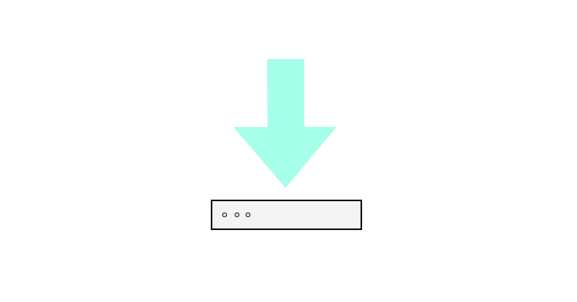
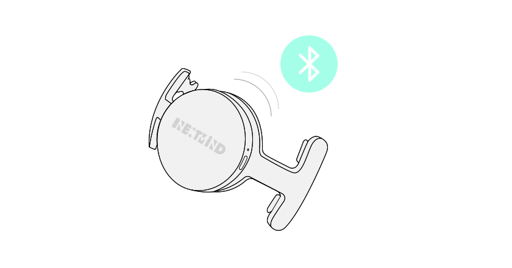
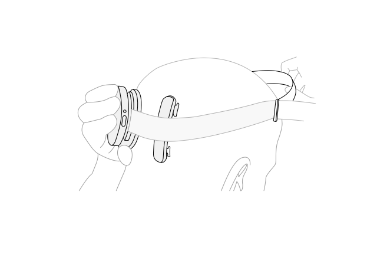
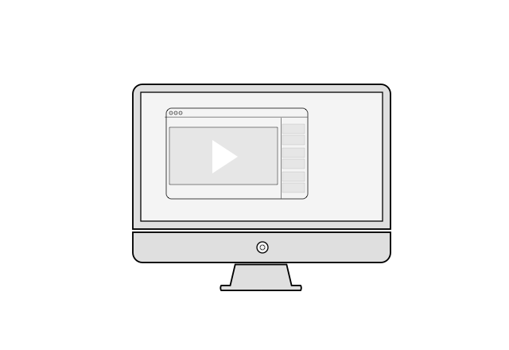
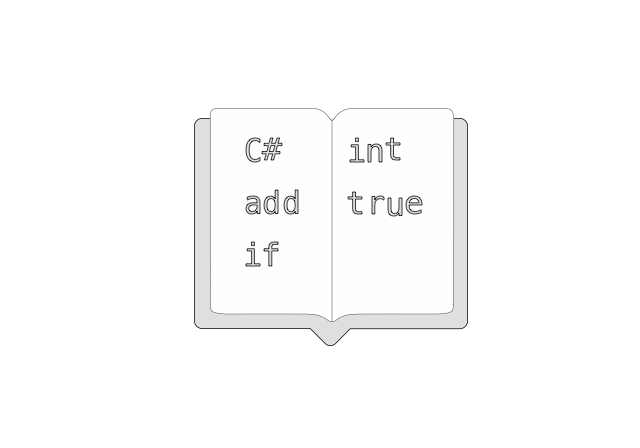

# NextMind Documentation

Learn here how to get started with your Dev Kit before launching your first session.

## Quick Setup

<table border="0">
<tr>

<td align="center">
<a href="downloads/README.md">
 
1. Download and Install
</a>
</td>

<td align="center">
<a href="devkit/quick-start.md">
 
2. Initialize the Sensor
</a>
</td>

</tr>
</table>

## Documentation

##### NextMind DevKit

- [Overview](devkit/overview.md)
- [Quick Start](devkit/quick-start.md)
- [Sensor Manual](devkit/sensor-manual.md)
- [Running demos](devkit/demo.md)
- [AR / VR setups](devkit/ar-vr-setups.md)
- [Troubleshooting](devkit/troubleshooting.md)

##### NextMind Unity SDK

- [Unity SDK Overview](unity-sdk/unity-sdk-intro.md)
- [Download](unity-sdk/download.md)
- [Changelog](unity-sdk/changelog.md)
- [Best Practices](unity-sdk/best-practices.md)
- [API Reference](https://snapchat.github.io/NextMind/api/)
- [Known issues & workarounds](unity-sdk/known-issues-and-workarounds.md)

##### Tutorials

- [Setting up the environment](tutorials/setting-up-environment.md)
- [Building a first application](tutorials/building-first-application.md)
- [Customizing the calibration](tutorials/customizing-calibration.md)
- [Customizing NeuroTag feedback](tutorials/customizing-feedback.md)

## Resources

Access all the necessary information and tools to develop your own mind-controlled applications.

<table border="0">
<tr>

<td align="center">
<a href="devkit/sensor-manual.md">
 
How to wear the Headset
</a>
</td>

<td align="center">
<a href="tutorials/README.md">
 
Watch Tutorials
</a>
</td>

<td align="center">
<a href="https://snapchat.github.io/NextMind/api/">
 
Access the API Reference
</a>
</td>

</tr>
</table>

Legal:
- [Safety / Regulatory Compliance](legal/regulatory.md)
- [Terms of use](legal/terms-of-use.md)
- [Privacy policy](legal/privacy-policy.md)

