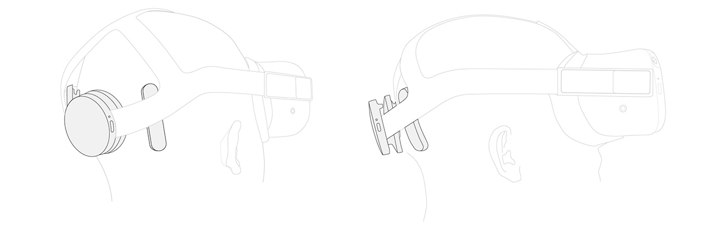
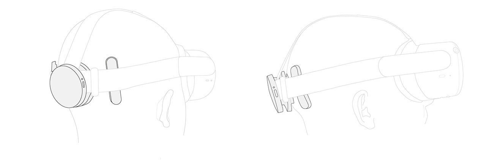
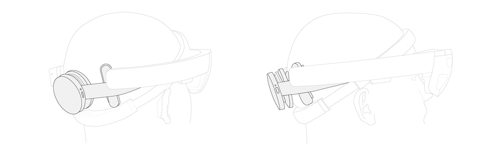
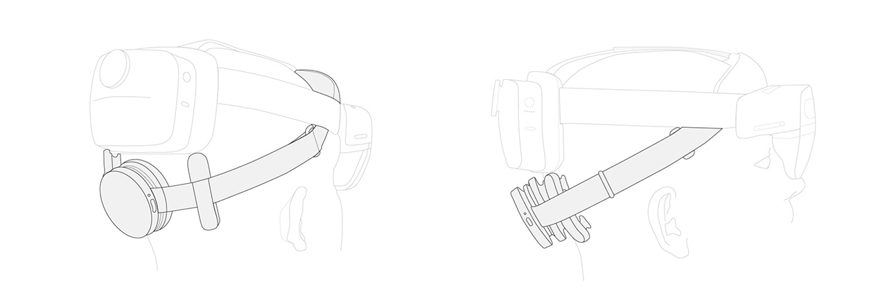
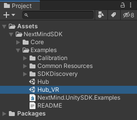

# AR / VR setups

This page explains how to wear and use the NextMind **Dev Kit** in AR/VR environments.

## Wear the NextMind Sensor with XR devices

### VR headsets

Most VR headsets have soft straps making them easy to combine with the NextMind Sensor. Simply clip the Sensor to the head strap, then adjust tightness and position to your comfort.

<blockquote class="important-block"><strong>Important</strong>: For optimal use, we recommend a tethered VR headset set-up. For Oculus Quest, connect it to your computer with the Link.</blockquote>

Straps slightly differ from one headset to another. Please find below the recommended positions for the most popular devices on the market:

#### Oculus Quest 1

#### Oculus Quest 2

### AR headsets

AR headsets being made of more rigid parts, we recommend the use of the provided headband. Wear the NextMind Sensor with it at the back of the head as usual, then place the AR device. Adjust the position of both devices so it’s as comfortable as possible.

#### HoloLens 1
For HoloLens 1, the NextMind Sensor easily fits between straps and the open section between the two arms of the headset.

#### HoloLens 2
Regarding HoloLens 2, loosen the headstrap so it can overlap the NextMind Sensor. If it's uncomfortable, tilt the headset forward and place the NextMind Sensor below the rear battery cover as shown on the pictures.

HoloLens 1 & 2 are fully compatible with the NextMind Unity SDK since it can be run on Windows 10.

## Run VR Demos

To explore first VR interactions, open the Hub_VR scene in the NextMind Unity SDK.

We'll soon be releasing a VR demo and preview of AR interactions in the NextMind Unity SDK.

## Develop AR/VR applications
There are many AR/VR Software Development Kits on the market.
To facilitate the integration of the NextMind Unity SDK in your developments we are providing examples that work with the Unity XR Toolkit package. However, feel free to use the NextMind SDK in combination with other VR and AR toolkits, such as SteamVR, MRTK, etc.

<blockquote class="important-block">
    <strong>Requirements for HoloLens development:</strong>
    <li>For HoloLens 1, use Unity 2019LTS with the MRTK and the deprecated Built-in XR</li>
    <li>For HoloLens 2, use Unity 2020.1 or later with OpenXR</li>
</blockquote>
