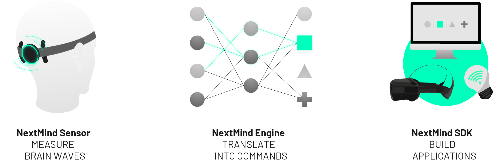

# Overview

NextMind technology decodes the attentional focus from your brain activity and allows you to control digital interfaces directly with your mind, in real-time. 

The NextMind Dev Kit offers an easy solution for anyone wanting to create mind-controlled applications, without having to deal with the technical challenges of brain signal processing. It is made of three core elements :

- NextMind **Sensor** detects neural signals in the visual cortex with high precision. It sits securely at the back of the head so you can move freely and command digital objects. A headband to keep the device in place is provided, and it can also be clipped directly onto a baseball cap or a AR/VR headset.
- NextMind **Engine** receives the encrypted brain waves via Bluetooth. It relies on algorithms combining machine learning and neuroscience models to convert intentional focus into outputs.
- NextMind **SDK** contains all the tools required to develop applications powered by our technology. Based on Unity, it includes several demos, tutos and examples to get you started.

This documentation will provide you all the necessary knowledge to get familiarized with the NextMind Dev Kit. Follow this [link](/unity-sdk/unity-sdk-intro.md#sensor-specifications) for full product specifications.
