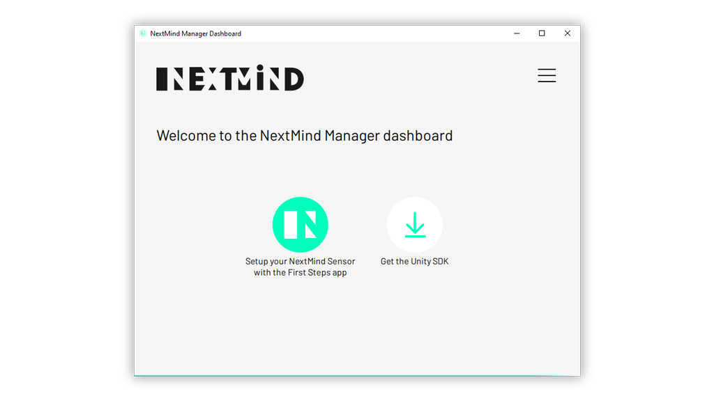
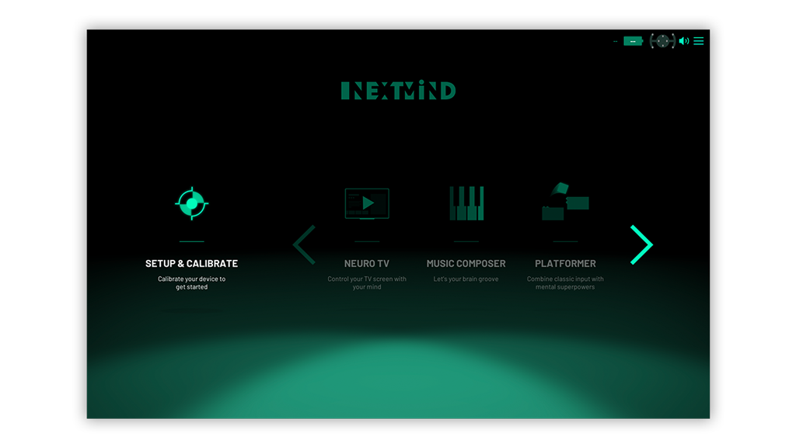

# Quick Start

## Install the NextMind Manager

Download the **_NextMind Manager_** from the [downloads page](../downloads/README.md) page and run the installer. The **_NextMind Manager_** allows you to configure your preferences, and get software updates notifications.

<blockquote class="note-block"><strong>Note</strong>: You need to run the NextMind Manager at least once before launching any NextMind enabled app.</blockquote>

<blockquote class="note-block"><strong>Note</strong>: It is a per-machine installation. The NextMind Manager must be set-up on every machine you use with the Dev Kit.</blockquote>

## Setup your NextMind Sensor

Launch the **_NextMind First Steps_** app from the **_NextMind Manager_**, then click on the `Setup & Calibrate` button on the main menu and follow the instructions. It will guide you to setup the Sensor on your head and run your first calibration.
Remember to recalibrate every time you move the Sensor on your head.

Visit the [sensor manual](/devkit/sensor-manual.md) page for more information about the headset.

Enjoy!
