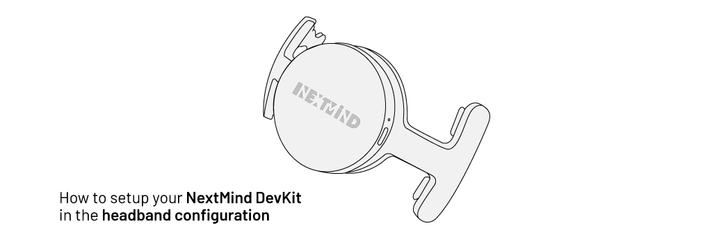
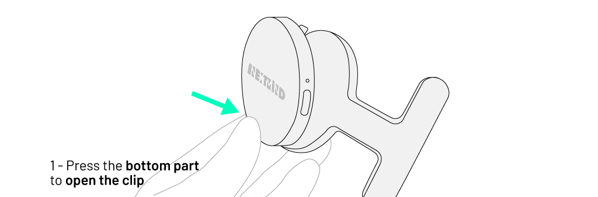
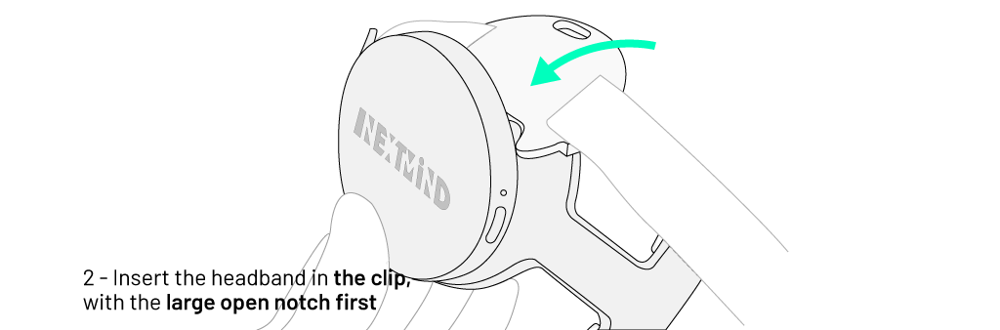
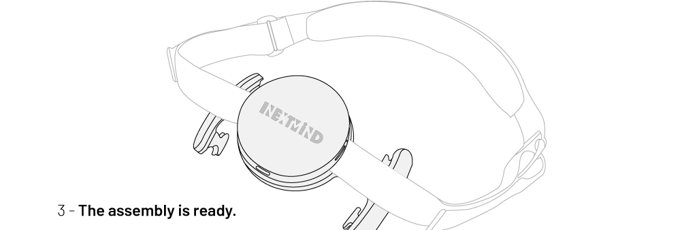
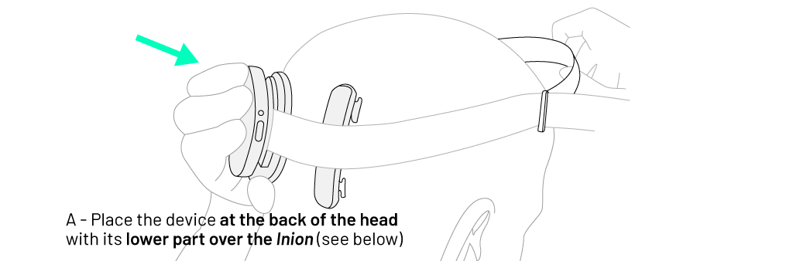
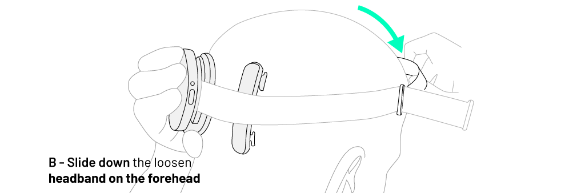
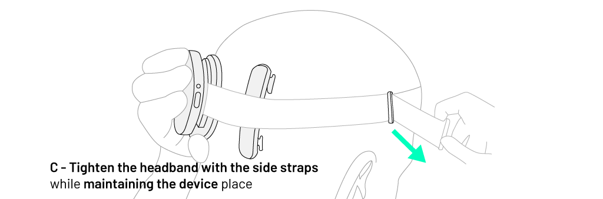
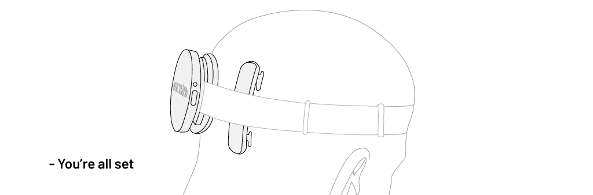

# Sensor Manual

### Powering up

The Sensor has a single button located on its side, next to a status LED.

Turn the device ON by pressing the Power button. The LED indicator should shine a continuous white light.

<blockquote class="note-block"><strong>Note</strong>: If this is the first time you are running the device, we suggest you make sure it is fully charged.</blockquote>

### Bluetooth pairing

The pairing process needs to be done within the **_NextMind First Steps_** app.

#### Pairing process

**Step 1:** Push the headset button for at least 4 seconds to start the pairing. The LED should start blinking. Release the button.

**Step 2:** Your headset will now be visible to your computer as `Nm` followed by 4 random characters, for example `Nm37e3`. Launch the pairing request from your computer.

**Step 3:** When the LED starts blinking quickly, push the button once to confirm and finish the pairing.

For Bluetooth issues please consult the [troubleshooting](troubleshooting.md).

### Powering off

Simply press the Power button to shut the Sensor down.

### Reset

To reset the device, turn it on then press the Power button for around 10 seconds.

<blockquote class="note-block"><strong>Note</strong>: Please note that a reset clears all pairing from the device and requires that the device should be also removed from the device list of the operating system's Bluetooth menu.</blockquote>

### Maintenance

You can check the battery level by using your operating system tools as well as in the app provided (if supported), via the corresponding SDK method (see [API-Reference](https://snapchat.github.io/NextMind/api/)). Recharge the battery with a standard USB-C cable connected to a computer or any USB charger (5V DC). Charging time is about 2 hours, and a single charge lasts for approximately 8 hours.

<blockquote class="note-block"><strong>Note</strong>: The device will automatically turn off if left inactive for 10 minutes.</blockquote>

<blockquote class="important-block"><strong>Important</strong>: For safety and performance reasons, do not wear the headset while it is being charged.</blockquote>

The device is powered by a Lithium-Polymer battery (3.7 V, 240 mAh) that is intended to operate in environments < 40°C. As it is not user replaceable, please contact support if you detect a problem or have any questions.

## Sensor Handling

In this section you will be shown how to handle the Sensor and optimize how it is used.

### Video instructions
https://user-images.githubusercontent.com/118914986/204538812-c8737360-f635-44d7-a7d5-65890126ec0d.mp4

### Headband assembly

To clip the Sensor onto the adjustable headband included, follow the steps below:

### Headset placement

1. Make sure the device is turned on.
2. Place the headset at the back of your head, **with the USB port facing down**.
3. Adjust the headband on your forehead and tighten it so that the electrodes are in close contact with your head. The electrodes should stay in place even when you move your head.
4. Slightly slide the headset in an up and down motion to part your hair and maintain the device as close to your skin as possible.

The following images illustrate those steps:

## Getting a good connection

The Sensor needs to be placed at the back of the head, where the visual cortex is located. A good reference point is the _inion_, a tiny bump on the back of your skull that can be easily felt with your hand. The lower part of the Sensor should rest right over this area.

<blockquote class="note-block"><strong>Note</strong>: The electrodes need to be in contact with your head and through your hair. Make sure the headband is tight enough, but not too tight. Make sure that you parted your hair with the up and down motion to correctly place the electrodes. Avoid jerking your head so that the connection remains optimal at all times.</blockquote>

