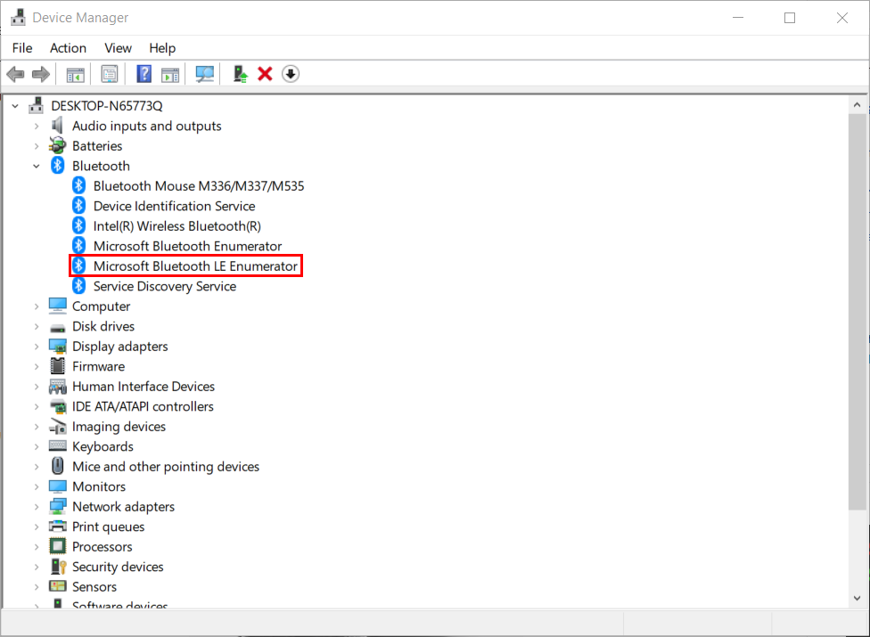
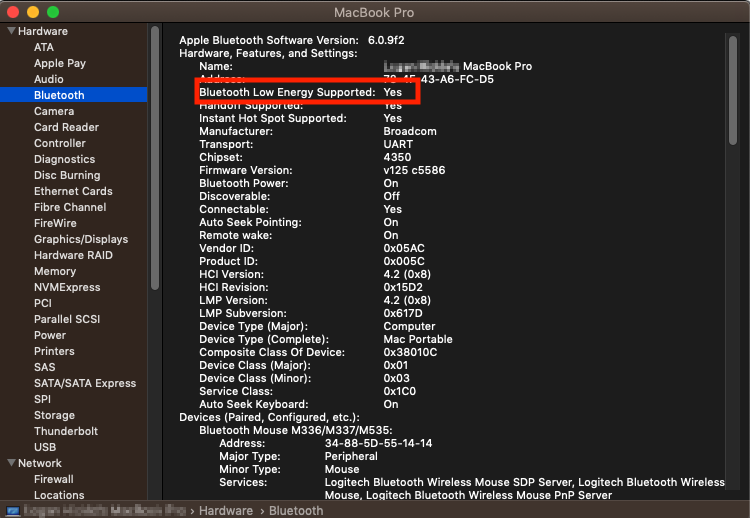

# Troubleshooting

## Bluetooth / pairing issues

NextMind headset is communicating with the Windows 10 or macOS computer with Bluetooth Low Energy (BLE).
This technology has no compatibility with Bluetooth BR/EDR (classic) but grants the NextMind device an longer battery life thanks to a considerably reduced power consumption.

### Compatibility

Modern Apple computers (2010+) come with BLE capabilities as well as most of the PCs laptops of different manufacturers (Lenovo, DELL, etc..).
Desktop PCs may or may not contain a network card that has dual capabilities Bluetooth/WIFI, and Bluetooth norm 4.0+ is required to have both the support for Classic/Low energy mode.

Here's how to determine if your Windows 10 computer is Bluetooth Low Energy compliant:

- Turn on your Bluetooth for your Windows 10 computer
- Press Windows + X to open the Start Menu.
- Select Device Manager.
- Select Bluetooth from the sidebar on the left. This will expand to show Bluetooth drivers.
- If there is a driver named Microsoft Bluetooth LE Enumerator then your Windows 10 computer supports Bluetooth Low Energy.

Here's how to determine if your macOS computer is Bluetooth Low Energy compliant:

- Click the Finder menu.
- Select About This Mac.
- Click on the More Info... button.
- Click on the System Report... button.
- Make sure you are in the Hardware section of the sidebar. Find and select Bluetooth.
- Check the Bluetooth Low Energy Supported line. If that line says Yes, your Mac computer supports Bluetooth Low Energy. If that line says No, your Mac computer does not support Bluetooth Low Energy and will not be compatible.

If your PC does not have Bluetooth Low energy support, we recommend either adding a PCI-E networking card to the machine such as the TP-Link AC120 (~$30) or a small USB Bluetooth dongle such as the ASUS BT-500.

### Device is not recognized by NextMind first steps application

If the NextMind device does not appear in the NextMindFirstSteps application nor in the "Update device" part of the NextMind manager, here is a few things to consider:

- Ensure your computer is Bluetooth LE-compliant as described in the "Compatibility" paragraph.
- Ensure your device is turned on by checking if the LED on the device is ON and that your computer Bluetooth is turned on.
- Ensure your device is paired with the computer. Only paired devices are appearing in the application, unless in the "Pairing step" of the application.
- Ensure your device is not connected to another computer. The NextMind device can only connect to one device at a time and won't be detected it in use by another computer or application (For instance if the device is connected in the NextMind Manager application in the "Update device" part).
- If the problem persists you should restart your Bluetooth card in the Windows Device Manager or reboot your PC.
- Make sure you have the latest drivers. Please refer to the [Checking if my Bluetooth driver is up to date](#Checking-if-my-Bluetooth-driver-is-up-to-date)

If all the troubleshoot actions have failed, you'll have to [delete all pairings](sensor-manual.md#reset) and reinitiate the [pairing procedure](sensor-manual.md#bluetooth-pairing)

### Connection issues

#### Device could not connect after a few attempts.

If several "Could not connect" or "Connection timeout" error messages are displayed by the application, it may traduce a pairing issue.

The most common issue is when the device has been hard reset by pressing for more than 10 seconds on the button. The device may still be considered as "paired" by the computer and you'll have to remove the device from the operating system Bluetooth menu then redo the [pairing procedure](sensor-manual.md#bluetooth-pairing)

#### Device suddenly disconnect in the application

If the device keeps disconnecting in the application, it may traduce a insufficient data rate or more rarely that the device lacks battery power.
It can happen for example while using a audio headset or a Bluetooth mouse at the same time.
We recommend testing with the NextMind device being the only Bluetooth device connected at a time. Future software updates will help mitigate this issue without losing too much performance. In the meantime, we recommend that you upgrade your Bluetooth networking to a 4.2/5.0+ card. (The more recent, higher the data rate).

If the data rate is sufficient but the device keeps disconnecting, it can be worth to [delete all pairings](sensor-manual.md#reset) and reinitiate the [pairing procedure](sensor-manual.md#bluetooth-pairing)

#### I can not connect to the device from the operating system menu

This is an expected behavior of the NextMind device. Connection with the device must be initiated from a NextMind application.

We acknowledge that it may seem unusual compared to let's say an audio headset. But unlike to an audio headset or a mouse, the NextMind device is not a "system" device. The device is communicating and only accessible from NextMind application, not directly with the OS.

#### I can connect to the device in the NextMindFirstsSteps application but not from the Unity Editor.

NextMind device should be usable directly from the Unity Editor without further configuration needed.
However, please ensure to keep the default options regarding the "Auto-connection" and/or the "Simulate Device" parameters.

### Miscellaneous

#### Checking if my Bluetooth driver is up to date

If you recently upgraded to Windows 10 or installed Windows 10 updates, the current driver may have been designed for an earlier version of Windows. To automatically check for driver updates:

1. In the search box on the taskbar, search for Device Manager, and then select Device Manager from the list of results.
2. In Device Manager, select Bluetooth, and then select the Bluetooth adapter name, which may include the word “radio.”
3. Press and hold (or right-click) the Bluetooth adapter, and then select Update driver > Search automatically for updated driver software. Follow the steps, then select Close.
4. After installing the updated driver, select the Start button, select Power > Restart if you're prompted to restart, and then check whether that fixes the connection issue.

#### Microsoft Surface

Note: Some Windows Surface present some Bluetooth connectivity issues and we recommend downloading the driver directly from the manufacturer site [here](https://support.microsoft.com/en-us/surface/download-drivers-and-firmware-for-surface-09bb2e09-2a4b-cb69-0951-078a7739e120)

If that still does not resolve the problem we recommend using the NextMind system on another set-up or with a small Bluetooth dongle such as the ASUS-BT500.

## Contacts / Signal quality

### Getting good contacts

The device records very small electrical voltages, so it is quite sensitive to household AC power. Being 30cm away from power strips is a good enough distance. Also, try not to touch metallic surfaces that might be linked to AC power. For example, some laptops tend to have bad electrical shielding.

Every time you move the headset, stay still for a few seconds (2-5) in order for the signal to stabilize, and avoid moving around or talking during critical parts (e.g. calibration).

## Calibration guide

We designed the NextMind calibration process to take less than 45 seconds.
Here are a few tips that should help you improve your calibration score.

https://user-images.githubusercontent.com/118914986/204539091-b2ba5823-5fcc-4282-8c66-30c75f49fe2b.mp4

### Check contact quality 
During the calibration process and for the entire experience, all electrodes must be in contact with your scalp. 
In the NextMind First Steps program, the contact status is displayed in the top right corner of your screen. Most or all contacts should be green to ensure optimal results. To prevent the occurrence of bad contacts please follow the Sensor Manual instructions and Getting Good Contacts tips.

### Ensure that Neurotags are clearly visible 
Set screen brightness to maximum and reduce any light reflection on your screen. Make sure you’re sitting close enough to the screen. This may help increase the response in your visual cortex and improve your scores. 

### Reduce interference
Other electronics and Bluetooth devices can create interference with the NextMind Sensor if they are close to your head. If you’re having difficulty getting a high calibration score, try turning off these devices (especially headphones).

### Create a calm environment 
Movement can interrupt the Sensor capturing your neural activity. Try to stay as still as possible, especially during the calibration process. Distractions, loud sounds, and speaking can also reduce your focus.  

### Practice makes perfect 
To achieve optimal scores, you need to keep your attention on the patterns in the background of each NeuroTag. When the green lines in the center form a triangle, this indicates the algorithms are detecting your focus. With practice, channeling your focus will feel more natural and comfortable. Try to stay relaxed and calm as you focus. 

<blockquote class="note-block"><strong>Note</strong> : Even if you get a low calibration score on your first attempt, it can still be possible to use your NextMind Sensor. </blockquote>

To test if your calibration is sufficient enough to continue, you can try activating one of the three NeuroTag disks at the end of the calibration process. If it works, then you can attempt testing the demos and then re-calibrating at a later time to try and improve your score.
