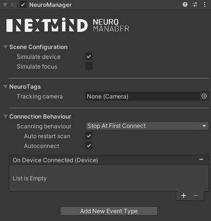
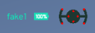

# Building a first application

## Prerequisite

- Unity 2019 LTS
- SDK's core files provided by importing `NextMindSDK.unitypackage` in your project

## Video overview
https://user-images.githubusercontent.com/118914986/204539491-bc48f290-9150-4eb1-8fb0-c6d486303165.mp4

## Presentation

The `NextMindSDK/Core` folder contains a **Runtime** subfolder 
 that embeds all the main assets (prefabs, textures, shaders, etc) you'll use in your projects.

<blockquote class="note-block">The other files in the `NextMindSDK/Core` folder consist of resources useful for building NextMind's custom editors and menus, low-level libraries that manage the hardware part (battery level, Bluetooth connection, etc) and brain data computing. It is not likely that you will use these directly.</blockquote>

## Step 1: Add the NeuroManager to the scene

The NeuroManager is the most important component of every NextMind application. Its main task is to establish the link between the NeuroTags present in the scene and the low-level computing. In addition, it provides useful settings and events needed to set up your scene.

This is the very first SDK asset you have to bring to your scene. Take a look into the `NextMindSDK/Core/Runtime/Prefabs` folder. Here you will find a prefab named `NeuroManager`. Drag & drop it into your scene.

<blockquote class="note-block">The main NextMind components are also accessible from GameObject/NextMind/ in the editor's top menu.</blockquote>

The prefab has one component named `NeuroManager`. It exposes various settings separated into several sections. By hovering the mouse cursor over the setting label, a tooltip will appear. Let's dive into these sections.

Let's keep the default values for now. We look further into settings in tutorial later on.

At this point of the tutorial, if you press play, you might think nothing happen. The system is actually silently setting itself up in the background. With these default values, the `NeuroManager` is asking the NextMind engine to create 3 fake devices, and connects to the first one. And that's it, since we do not have a NeuroTag added in the scene.

Optionally, before adding a NeuroTag to the scene, you may want to make sure that your device is correctly connected (even if it is fake at this point). To do so in the easiest way possible, we have provided another prefab called `ConnectedDeviceStatus`. You can find it in `NextMindSDK/Core/Runtime/Prefabs/Utilities`. Just drag & drop it to your scene. 

You should now see new elements in the top-right corner of the game view. If you press play again, you'll see the device's name and battery percentage after a few seconds. The last part represents a minimalistic view of the device and its electrodes, turning red or green depending on the signal quality of each electrode.

So now, let's add a NeuroTag we can focus on.

## Step 2: Create a NeuroTag

To interact with an object in your scene with the NextMind device, you will need to attach the NeuroTag component to it.

<blockquote class="note-block">By placing this component on an object, the system will apply a special visual signature to it. It will then be capable of retrieving this signature in the user's brain response within other NeuroTags signatures. In addition, it provides useful settings and callbacks you can register to for different types of events.</blockquote>  

Now come back to the `Prefabs` folder, and open the `NeuroTags` subfolder. Here you will find various types of NeuroTags we have prebuilt for your convenience. Let's drag & drop the `CubeTag` into the scene. 

<blockquote class="note-block">This is basically the Unity cube primitive, on which we added a `NeuroTag` component and some feedback elements which we will talk about later. Moreover, the visual part (the cube itself) is set as a child of the NeuroTag element for clarity.</blockquote>

Place the CubeTag in front of the `Main Camera`, not too far away (between 3 and 4 meters/units is generally a good distance at a scale of 1), so that it is fully visible.

Now you can press play again. You may now notice that, after the first phase, when the system is creating fake devices and connects to the first one, the cube starts to alternate rapidly between its original grey color and something more textured, showing a grey and white pattern. It means the NeuroTag is now able to be triggered by the system.

## Step 3: Device and input simulation

To test and debug without having to set up an actual device each time, you can use the very convenient `Simulate device` option in the NeuroManager. As you start the application, if this option is activated (it is by default), the engine will create 3 fake devices. These devices will behave exactly as real devices: they can be discovered by a Bluetooth scan, you can connect to them, they have a name, connection status, id, etc... 

<blockquote class="note-block">We chose to create 3 fake devices so you can design your app to anticipate the scenario of having multiple devices available at the same time.</blockquote>

In addition, you can activate the `Simulate focus` option that emulates the user's input by converting mouse input (actually the left click) into mind input. Clicking on a NeuroTag will trigger the same behavior as if a user was focusing on one with an actual device.

## Step 4: Run

You are all set! Press play, wait for the system to initialize, and try to simulate a mind input by clicking on the cube. 

Now you may see a green triangle taking shape when you keep the left mouse button down, and disintegrate as soon as you release it. That's basic feedback brought by the NextMind SDK, but you could imagine anything else. If you would like to go further and see some other feedback examples, you can have a look at the SDKDiscovery scene.

Well, that'll be all for this tutorial, you've just built your first scene by using NextMind technology! :tada: It's now up to you to follow up with next tutorials and learn how to link different NeuroTags events to custom actions.

