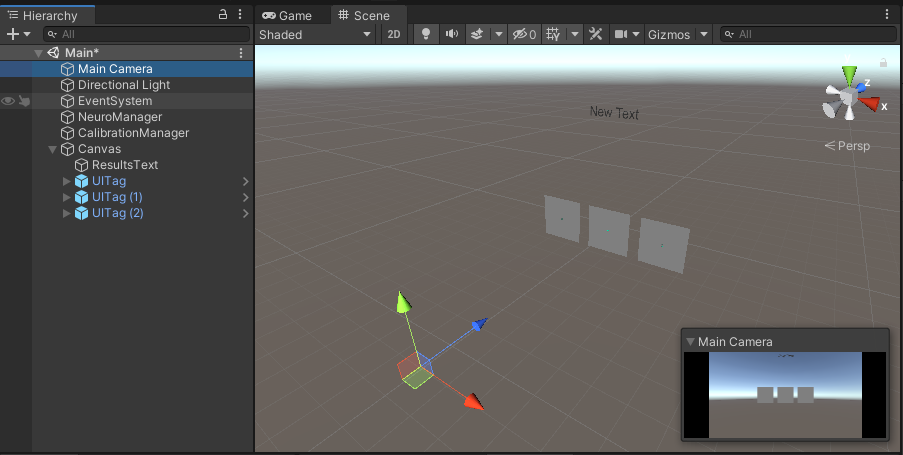

# Customizing the Calibration

## Prerequisites

- Unity 2019 LTS
- SDK's core files provided by importing `NextMindSDK.unitypackage` in your project

## Presentation

Calibration is an essential step of any application developed with the NextMind SDK. In a few words, it generates a mathematical model from the user's brain signals that helps the system understand which NeuroTag is currently being focused on, and therefore triggering the right actions. Without calibration, a user won't be able to use a mind enabled application. 

### The calibration process

While calibrating, the system ***supervises*** the user's attentional focus on a particular NeuroTag. This operation, called ***trial***, is repeated 12 times throughout the whole calibration process, on one or more NeuroTags. A calibration is composed of 12 trials (this number will likely be reduced in further releases) of 3 seconds each. The user's only task is to stay focused on the supervised NeuroTag during each trial. The application must direct the user's focus on the supervised NeuroTag. The simplest way would be to show only one NeuroTag at a time, but you can find smarter ways to achieve it, fitting your application design.

After the user goes through all the trials, the calibration is complete and the engine starts to process the data in the background. Once this processing phase is over, the system sends a score to the application ranging from A (best) to E (worst).

The score is then shown to the user, and the application should allow him or her the possibility to start the calibration process over again, in case the user is unsatisfied with the score given.

In the SDK, we provide an example of a calibration scene. It can be found in `NextMindSDK/Examples/Calibration/Calibration.unity`. This scene may be used freely in your own application. However, you may want to customize the calibration phase to fit your application design, or for any other reason.

## The CalibrationManager

The CalibrationManager, provided with the SDK, is the Unity component responsible for the calibration process. It only exposes the 2 following properties: 

- **NeuroTags**: the list of NeuroTags which will be used during the calibration process. For every trial, a new NeuroTag is used from within this list, starting with the first one and incrementing the index at each trial. You will have to reference at least one NeuroTag here. Referencing more than the number of trials in the calibration is useless, any overflowing NeuroTags will be ignored.  
- **Tag calibration behaviour**: the behaviour applied to a NeuroTag used during a trial. 2 options are available :
  
  - *Default*: use the default behaviour. The calibration initialization will immediately scale down all the NeuroTags in the list to `Vector3.zero`. Then, at the beginning of a trial, the NeuroTag used during this trial is smoothly scaled up to its original scale, making it visible to the user. At the end of a trial, the NeuroTag is smoothly scaled down to `Vector3.zero`, hiding it from the user.
  - *Custom*: use a custom behaviour. By choosing this option, some UnityEvents are added to the CalibrationManager inspector. The default behaviour is no longer applied, and it is up to you to link the functions you want to display and hide the NeuroTags from the user.
  
  

## Building a basic calibration

Let's say we want a basic calibration where the user has to successively focus on 3 NeuroTags positioned in front of him. We want to use the default behaviour showing the NeuroTags by scaling them up and down. After calibrating, we want to display the results in a UI Text on the screen.

### Create the scene

The scene must contain :

- A NeuroManager : the main component of a mind enabled scene
- A CalibrationManager : the component managing the calibration process
- 3 NeuroTags : let's use the UITag prefab from the SDK (*Assets/NextMindSDK/Core/Runtime/Prefabs/UITag*) 
- A UI Text : basic Text to display the score



### Reference the NeuroTags 

You'll first have to reference the NeuroTags on the CalibrationManager so they are used during the calibration process. A simple drag & drop should do the trick.


### Start the calibration

For this step, we'll have to create a simple C# script. It will call the StartCalibration function on the CalibrationManager, receive the results and display it on the UI Text element. 

Create a script called SimpleCalibrationExample, and add a serialized field for the CalibrationManager, so we can reference it easily from the inspector. 

```c#
using UnityEngine;
using NextMind.Calibration;

public class SimpleCalibrationExample : MonoBehaviour
{
    [SerializeField]
    private CalibrationManager calibrationManager;
    
    // Start is called before the first frame update
    void Start()
    {
    }
}
```

Now we may want to directly call StartCalibration in the Start function. But first, the calibration process needs to have the NeuroManager up and running. 

<blockquote class="note-block">The NeuroManager is ready when the system has loaded and a device is connected.</blockquote>

There are several solutions to achieve this. Without a line of code, we could just link the CalibrationManager.StartCalibration to the NeuroManager's OnDeviceConnected event.

  

But let's do it another way, keeping the coding for now, so you have a better comprehension of what's happening. The solution we will be implementing here is to create a coroutine yielding over the `NeuroManager.IsReady` function, and only then, starting the calibration:

```c#
using System.Collections;
using UnityEngine;
using NextMind.Calibration;
using NextMind;

public class SimpleCalibrationExample : MonoBehaviour
{
    [SerializeField]
    private CalibrationManager calibrationManager;

    // Start is called before the first frame update
    void Start()
    {
        StartCoroutine(StartCalibrationWhenReady());
    }

    private IEnumerator StartCalibrationWhenReady()
    {
        // Waiting for the NeuroManager to be ready
        yield return new WaitUntil(NeuroManager.Instance.IsReady);

        // Actually start the calibration process.
        calibrationManager.StartCalibration();
    }
}
```

Back to the inspector, add the SimpleCalibrationExample component to the CalibrationManager, then reference the CalibrationManager in the field you created. 

If you press play now, you'll see the NeuroTags disappear, then reappear smoothly one after another. This is the calibration process, running with the NeuroTag's default behaviour. 

### Displaying the results

Now that we have a calibration running, we want to display the user's results when the calibration is complete. 

Create a serialized field for the Text element.

```c#
[SerializeField]
private Text resultsText;
```

Then, at the same time we are asking for the calibration to start, register as a listener of `CalibrationManager.onCalibrationResultsAvailable` events. The callback attached to these events takes 2 parameters : 

- **Device**: the device used during the calibration
- **CalibrationGrade**: a simple enumeration representing the user's score from A (best) to E (worst).

```c#
using System.Collections;
using UnityEngine;
using UnityEngine.UI;
using NextMind.Calibration;
using NextMind;
using NextMind.Devices;

public class SimpleCalibrationExample : MonoBehaviour
{
    [SerializeField]
    private CalibrationManager calibrationManager;

    [SerializeField]
    private Text resultsText;

    // Start is called before the first frame update
    void Start()
    {
        StartCoroutine(StartCalibrationWhenReady());
    }

    private IEnumerator StartCalibrationWhenReady()
    {
        // Waiting for the NeuroManager to be ready
        yield return new WaitUntil(NeuroManager.Instance.IsReady);

        // Actually start the calibration process.
        calibrationManager.StartCalibration();

        // Listen to the incoming results
        calibrationManager.onCalibrationResultsAvailable.AddListener(OnReceivedResults);
    }

    private void OnReceivedResults(Device device, CalibrationResults.CalibrationGrade grade)
    {
        resultsText.text = $"Received results for {device.Name} with a grade of {grade}";
    }
}

```

Back to the editor, drag and drop the Text where you want to display the results in the right field on SimpleCalibrationExample, then press play. After 12 trials, the score should be displayed. 

## Customize the NeuroTags behaviour

A NeuroTag's calibration behaviour is the way a NeuroTag is going to behave during 3 critical phases of the calibration process:

- the calibration initialization
- the time this specific NeuroTag starts being supervised by the CalibrationManager
- the time this specific NeuroTag stops being supervised by the CalibrationManager

The default behaviour applied to the calibration NeuroTags may not fit your application design. It simply scales up or down to show/hide the NeuroTags. For example, you may want to have a sound play while fading out. Luckily, the SDK allows you to customize this part of the calibration process. It can be done in 2 different ways:

- Within the editor, by using the UnityEvents on the CalibrationManager
- By coding a custom class inheriting from TagCalibrationBehaviour and implementing the 3 dedicated functions. The advantage here is that these 3 functions are coroutines, and can therefore be awaited.

### Detailed calibration process

First, let's see the calibration algorithm in detail and the events thrown at each calibration phase, just after a call to `CalibrationManager.StartCalibration`:

1. First the NeuroTags are initialized by calling the `TagCalibrationBehaviour.OnInitialize` event to each one of them. For instance, the OnInitialize function of the default TagCalibrationBehaviour will set their scale to Vector3.zero.
2.  After this first phase, the engine actually starts the calibration. If an error occurs, `CalibrationManager.onCalibrationError` event is triggered. 
3. If the calibration starts successfully, the following process will be repeated 12 times while iterating over the NeuroTags referenced on the CalibrationManager (first loop with the NeuroTag at the index 0, second loop with the NeuroTag at the index 1, etc...):
   1. The start calibrating behaviour is played on the active NeuroTag. For instance, the default behaviour is to scale it up. This step can be awaited in case of implementing your own TagCalibrationBehaviour. However, using the CalibrationManager's UnityEvent will immediately go to the next step. 
   2. Wait for 3 seconds
   3. The end calibrating behaviour is played on the active NeuroTag. For instance, the default behaviour is to scale it down. This step can be awaited in case of implementing your own TagCalibrationBehaviour. However, using the CalibrationManager's UnityEvent will immediately take you to the next step
4. `CalibrationManager.onCalibrationEnd` is triggered.
5. The engine processes the data to assess the user's calibration score.
6. If an error occurs during this phase, `CalibrationManager.onCalibrationResultsError` event is triggered. 
7. As soon as the results are available, `CalibrationManager.onCalibrationResultsAvailable` event is triggered. 

### The CalibrationManager custom behaviour events

The first thing to do when customizing the NeuroTags behaviour is to switch the *Tag calibration behaviour* property from *Default* to *Custom*.

 

As you can see, it exposes 3 UnityEvents that you can use for the 3 calibration phases we mentioned earlier. At this time the default behaviour will no longer be applied and will be replaced by the functions you link to these UnityEvents.

### Implementing a custom behaviour class

A more elegant way of replacing the default behaviour is to implement your own custom class, inheriting from TagCalibrationBehaviour. Here is the minimum implementation:

```c#
using System.Collections;
using NextMind.Calibration;
using NextMind.NeuroTags;

public class MyCustomTagCalibrationBehaviour : TagCalibrationBehaviour
{
    public override void OnInitialize(NeuroTag tag)
    {
        return;
    }

    public override IEnumerator OnStartCalibrating(NeuroTag tag)
    {
        yield break;
    }
    
    public override IEnumerator OnEndCalibrating(NeuroTag tag)
    {
        yield break;
    }
}

```

Once your custom class is created, you have to register it to the CalibrationManager. It is done using the `CalibrationManager.SetNeuroTagBehaviour` function. As soon as you call it with an instance of your custom behaviour, the default behaviour and the CalibrationManager editor's UnityEvents will stop being applied.

```c#
using UnityEngine;
using NextMind.Calibration;

public class MyGameBehaviour : MonoBehaviour
{
    public CalibrationManager calibrationManager;

    private void Start()
    {
        calibrationManager.SetNeuroTagBehaviour(new MyCustomTagCalibrationBehaviour());
    }
}
```

### SDK's Calibration

If you already went through the SDK's example scenes, you may have already seen the calibration scene we provided. This is a customized calibration using only one NeuroTag for the whole calibration process. It gives users visual feedback relating to calibration progress in two ways : 

- Showing a particle system shaping more and more into a brain as the calibration progresses
- Make a white border grow around the NeuroTag and representing each trial completed with a dot  

Another type of visual feedback is the glow effect growing around the NeuroTag. It is synchronized with its confidence value. Finally, we added a quick white flash to appear on the NeuroTag at the end of each supervision, which visually separates each trial. 


The assets used to build this calibration are available in the SDK at `Assets/NextMindSDK/Examples/Calibration`. Feel free to dive into it to get a more in-depth understanding of how it works. The main scripts are :

- `MonoTargetCalibrationStep.cs` : the manager that makes every aspect evolve during the whole process
- `MonoTargetBehaviour.cs` : a class derived from TagCalibrationBehaviour, used to know when a trial is over in order to start and wait for flash animation at the end of each trial.

## Best practices

You should keep in mind that calibration is key to delivering the best possible user experience. If users cannot calibrate correctly and continually receive a poor score, they will be just as frustrated when using your application when it doesn't respond as intended.

The user's behavior during the calibration will be dictated by how you design your calibration: will the user generate large neck movements in a VR scene? Will the environment of your calibration scene create distraction or unconscious disturbances? Make sure you read the general [Best Practices](../unity-sdk/best-practices.md) section of this documentation.