# Customizing NeuroTag Feedback

## Prerequisites

- Unity 2019 LTS
- SDK's core files provided by importing `NextMindSDK.unitypackage` in your project

## Presentation

An interaction is a loop between the user and his/her environment. For example, when your hand reaches an object, it gets a confirmation thanks to the sense of touch. This confirmation is the **feedback** and is key to a pleasing and efficient user experience. It can take many forms and is present in every domain: buttons beeping, knobs clicking, Graphical User Interface (GUI) elements highlighting, etc... 

Giving direct feedback to the user about his actions is always good practice, and it is even more important with a visual Brain-Computer Interface since this is a new kind of interaction and experience. The way to correctly focus on a NeuroTag is not obvious and not easily put into words. The user needs to learn, in an intuitive and rewarding way, when his/her action is the right one. When interacting with NeuroTags, there are two types of direct feedback:

- Inform the user about the strength of his focus (as the sense of touch would inform your brain that your finger is placed on a keyboard key) 
- Inform the user when he/she has focused strong enough to “trigger” the NeuroTag 

## Implementation in the SDK

The SDK, and more specifically the NeuroTag component, allows the developer to link actions to different types of events. They are used at first to link "regular" actions like opening a menu, fire a bullet, and so on...this is also the perfect place to implement the feedback for each of these event types. 

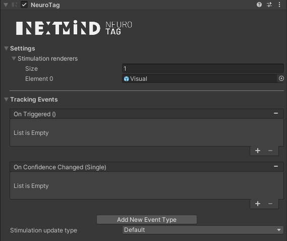

The first one, OnTriggered, will be used to inform the user when he/she has focused strong enough to "trigger" the NeuroTag. A common feedback for this type of event would be to play a validation sound. The implementation is pretty straightforward and can be achieved with basic knowledge of Unity development. 

The second one, OnConfidenceChanged, may be more complex. We will use it to indicate the strength of the user’s focus. 

### OnConfidenceChanged

`OnConfidenceChanged` event is invoked at each frame (if the confidence value changed since the last frame), providing the confidence value that the system has about the user focus on the NeuroTag. It can be seen as the user’s focus strength. The confidence being a float value between 0 and 1, it could be dynamically linked to various Unity component parameters: animation speed, AudioClip volume, standard shader’s map strength values, etc… 

### The triangle feedback

We provide a green triangle feedback in the NextMind SDK. The green lines form a triangle when you focus on the NeuroTag linked to it. 

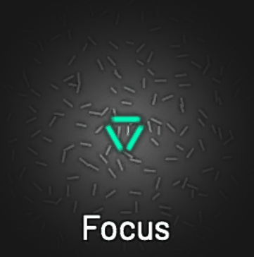

This triangle actually has two goals: 

- To help the user focus on the central point of a NeuroTag 
- To indicate the strength of the user's focus (i.e. the confidence that the system has about the user focus on this particular NeuroTag). Providing the user with real-time visual information induces a positive loop increasing his/her neural answer to speed up the validation of NeuroTags. 

The triangle feedback is only one example of what could be implemented. In your projects you may want, for technical, aesthetic, or any other reason, to adapt this feedback, or even use a completely different one. You may also want to not use feedback at all, but we don't recommend it! Your custom feedback can be anything: a sound, movement, scaling, action, etc... But before talking about customization, let's see how the triangle feedback done. 

TriangleFeedback is a prefab located in `NextMindSDK/Core/Runtime/Prefabs/Feedbacks`. If you open it, you can see the parent object (`TriangleFeedback`), which will manage the animation, and its 3 children (`Side1`, `Side2` and `Side3`) which are just the visual part of the feedback, the 3 sides of the triangle. 

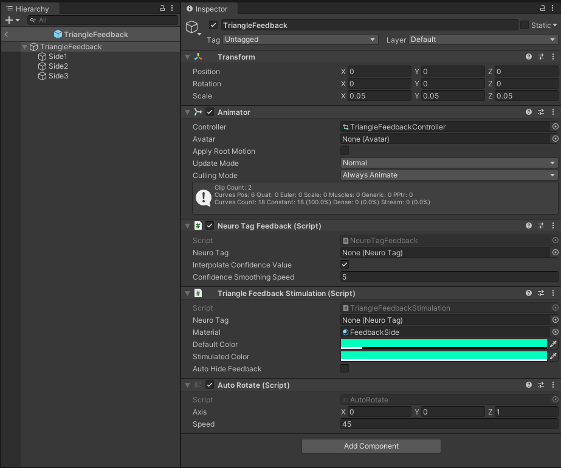

The parent element has 4 components: 

- Animator
- NeuroTagFeedback
- TriangleFeedbackStimulation
- AutoRotate

#### TriangleFeedbackStimulation

`TriangleFeedbackStimulation` makes the triangle sides blink at the same pace as the NeuroTag, making them a bit easier to be activated with the NextMind Sensor. This component is NOT required for custom feedback. 

#### AutoRotate

`AutoRotate` makes the triangle sides rotate around the forward axis. This component is not required. 

#### Animator & NeuroTagFeedback

`Animator` and `NeuroTagFeedback` components work together. `NeuroTagFeedback` is responsible for listening to confidence value updates, interpolating these values (or not, following the chosen parameters), and forwarding them to the Animator. 

The Animator will then use a blend tree to interpolate between 2 states (or more depending on your project) using the forwarded confidence value as the blend parameter. These 2 states are actually 2 animations, each with only one keyframe. They define the position of the triangle sides when the confidence level is at minimum (TF_NoConfidence) and at maximum (TF_FullConfidence). All the calculations for the intermediate positions are done by the blend tree. 

  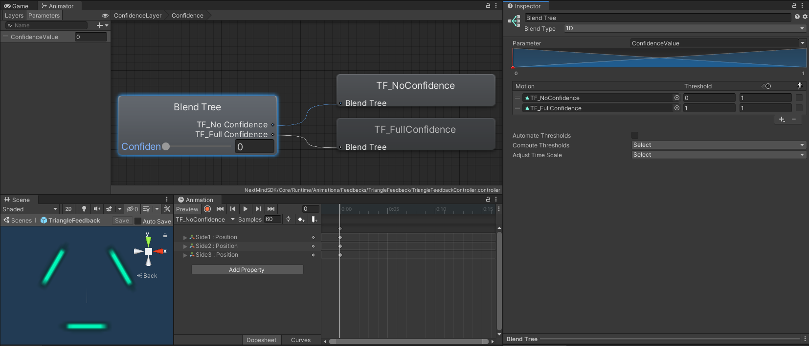

This system allows you to implement new complex feedback loops quickly and easily. With the TriangleFeedback prefab we are dealing with only three object positions, but you could think about combining rotation, scale, particle effects, sound volume and so on, on many more objects to design feedback loops that fit with your application. Please see the "Custom feedback creation - Third method" section to have an example of how to build your custom feedback loops using this system. 

## Custom feedback creation

As explained before, you have several options for implementing your own feedback. Choose the right one for your project needs: 

- Linking dynamically a Unity's component function onto the OnConfidenceChanged event of the NeuroTag component 
- Writing a custom function and linking it to the OnConfidenceChanged event 
- Using NeuroTagFeedback with the animation system 

### Preliminary scene setup:

Before diving into these 3 methods, let's prepare a scene with a valid NeuroTag. 
The first step is to create a new scene. Call it for example *FeedbackTutorial*, then add the NeuroManager (right-click in the hierarchy view, then NextMind/NeuroManager). Ensure its *Simulate device* and *Simulate focus* properties are checked. This will make it easier to test the NeuroTags as you go. However, you should always do a final check activating NeuroTags using the NextMind sensor to ensure they are all working properly.  

Then create a simple cube and add a NeuroTag component onto it. Drag and drop the NeuroTagMaterial you can find in `NextMindSDK/Core/Runtime/Materials`  onto the cube. Your scene should now look like this:

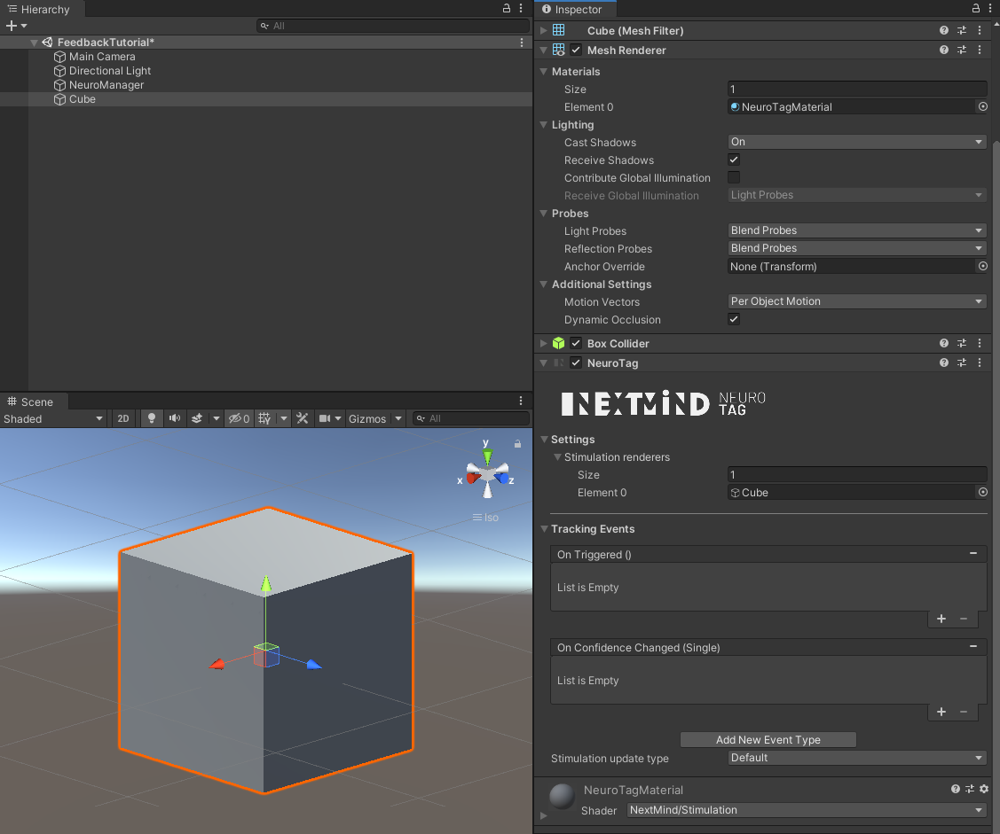

### First method: Dynamic link onto OnConfidenceChanged

This is the fastest way to create your own feedback loop. It could be limiting though. As an example, let's say we want a sound to become louder as confidence increases. 

Add an AudioSource to the cube and reference the AudioClip you want. This AudioClip should be a perfect loop. For your convenience we provide some for you; feel free to use them in your projects: [audioFeedback 1](images/Feedback/audioFeedback_1.wav) / [audioFeedback 2](images/Feedback/audioFeedback_2.wav)

Attach your audio clip, check the loop property and set the volume at 0. The AudioSource should look like this:
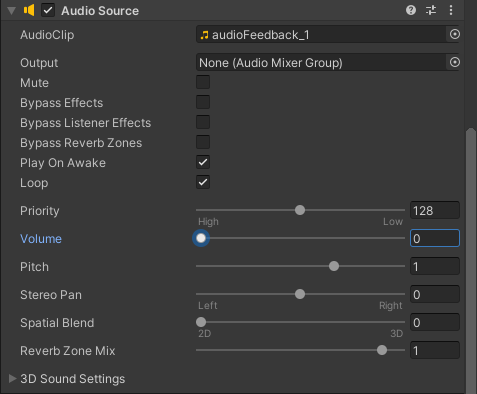

The last step is to link the AudioSource's volume to the OnConfidenceChanged event. To do this, add a new listener to the OnConfidenceChanged event of the cube's NeuroTag in the editor and link it to `AudioSource.volume` which you can find in the *Dynamic float* section: 
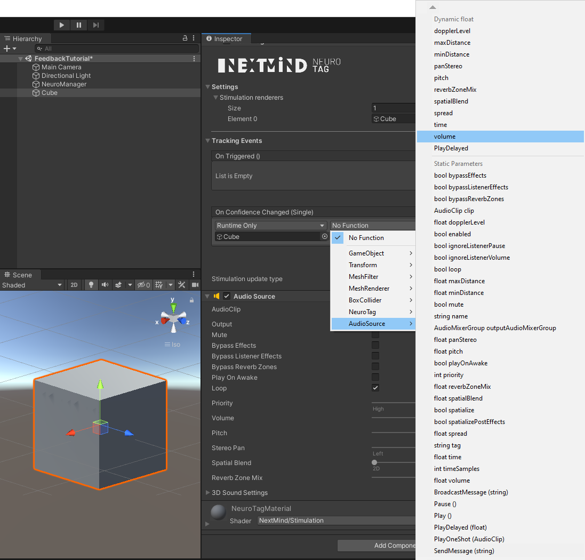

### Second method: Custom OnConfidenceChanged function

Creating a custom function that you link to the OnConfidenceChanged event is slightly more complex but opens up more possibilities. If you are used to scripting, this method will fit your needs. As a first example, let's create feedback that logs a message in the console. 

```c#
using NextMind.NeuroTags;
using UnityEngine;

[RequireComponent(typeof(NeuroTag))]
public class ConfidenceLogger : MonoBehaviour
{
  private NeuroTag neuroTag; 

  private void Awake()
  {
     // Get the NeuroTag and add the listener through code. 
	// This is given as an example but it could be done by referencing the OnConfidenceChanged function in the editor as well.
    neuroTag = this.GetComponent<NeuroTag>();
	neuroTag.onConfidenceChanged.AddListener(OnConfidenceChanged);
  }

  private void OnDestroy()
  {
	neuroTag.onConfidenceChanged.RemoveListener(OnConfidenceChanged);
  }

  private void OnConfidenceChanged(float val)
  {
	// Map the value on a 0 - 100 range to get a percentage.
	float percentage = val * 100;

	Debug.Log($"User is focusing on this NeuroTag at {percentage} % !");
  }
}
```

You then just have to add the ConfidenceLogger component to your NeuroTag and press play. After focusing on the NeuroTag, the message will appear in the console:
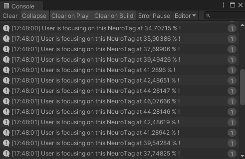

### Third method: NeuroTagFeedback system

This last method allows the developer to create complex feedback designs without typing a line of code. It may be the best solution for you if you are not used to C# scripting. However, it is better to have a basic knowledge about Unity's animation system. 

The principle is to link specific animations to given confidence values of a NeuroTag. 
A simple example could be the following: we want a character to walk when it is not focused on (confidence = 0) by the user, and to run when fully focused on (confidence = 1). For intermediate confidence values, we would like a hybrid animation between walk and run. In this scenario, we are linking 2 animations, walk and run, to 2 confidence values, 0 and 1. 

In order to build this system, we can leverage the power of Unity's [blend trees](https://docs.unity3d.com/Manual/class-BlendTree.html) in a adequation to a convenient component called NeuroTagFeedback from the NextMind SDK. 

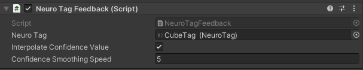

When attached to a NeuroTag, NeuroTagFeedback will listen to the confidence updates it receives. Each time a confidence value is received, it will be smoothed regarding the last received value, and sent to the "ConfidenceValue" parameter of the Animator. 
On its side, the Animator will use a blend tree to interpolate between the animation clips attached to it. Its blend parameter is ConfidenceValue. 

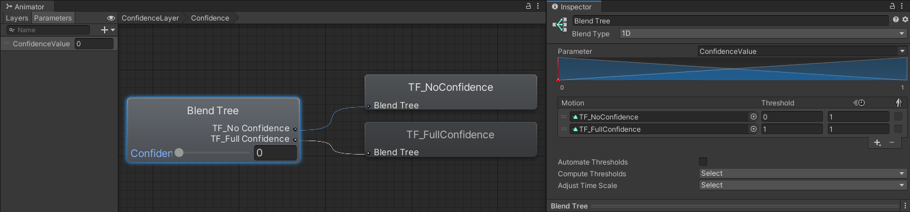

To sum up, implementing this system means you have to create the Animator and different animation clips, and attach them to the animator's blend tree and finally add a NeuroTagFeedback component on your NeuroTag. 

Let's do this. We will create for example a feedback loop that starts as parallel white lines at low confidence levels, and becomes a green X at high confidence levels. 

First create a basic scene with a NeuroManager and add a cube with a NeuroTag component, as described in the Preliminary scene setup section. 

#### Animator setup

Create an Animator and let’s call it *CustomFeedbackAnimator*. Right-click inside the Animator window and go to `Create State/From New Blend Tree`. Double-click on the created state to edit the blend tree. In the Parameters tab of the Animator, create a new parameter and name it ConfidenceValue (you can also rename the existing default parameter). 
Now right click on the BlendTree and add 2 motions. Your animator should now look like this: 

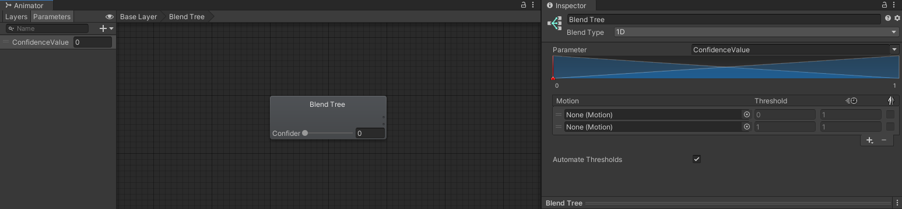

#### Custom feedback object creation

Create one empty object as a child of the cube in your scene. Call it *CustomFeedback* for example. 
Then create two sprites as children of the CustomFeedback object and attach the Feedback texture which is located at `NextMind/Core/Runtime/Texture/Feedback.png. Move the CustomFeedback object on the surface of the cube so the sprites are visible. 
Add the NeuroTagFeedback component to the CustomFeedback object. It should automatically add an Animator component on it. Drag & drop the CustomFeedbackAnimator in the controller field of the Animator component. 
Drag & drop the Cube object in the NeuroTag field of the NeuroTagFeedback component.

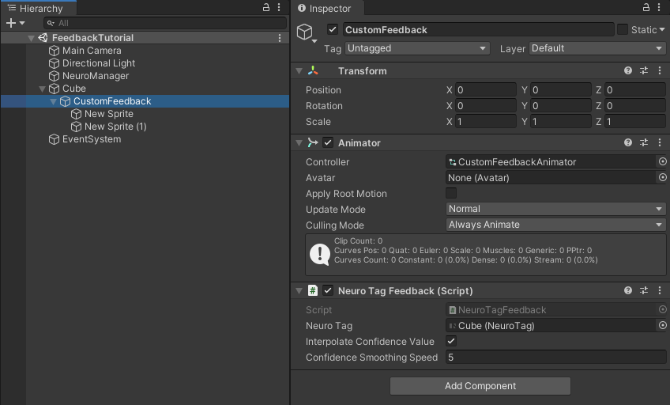

#### Animations creation

You can now create 2 animations. Let’s call them *LowConfidence* and *HighConfidence*. 
Reference the *LowConfidence* animation in the first motion field of the blend tree, and the *HighConfidence* animation in the second field. 
Highlight the *CustomFeedback* object in the hierarchy, then open an Animation window. 

Select the *LowConfidence* in the Animation window: 

- Click on the record button. 
- Place the 2 sprites as you want them when the user is not focusing. In our example one is at (-0.03,0,0) and the other is at (0.03,0,0). 
- Select both sprites and change the color to pure white (even if they are already white, so that Unity create the keyframe for it). 
- Click again on the record button to stop the recording. 

You should now see only one keyframe for each animated property:
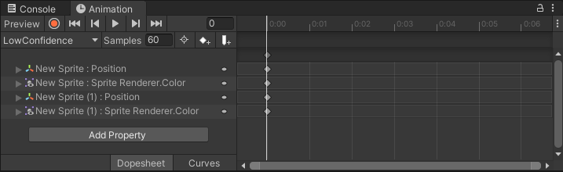

Now select *HighConfidence* on the Animation window 

- Click on the record button. 
- Select both sprites and set the position to (0,0,0). 
- Select 1 sprite and set rotation to (0,0,-45), select the other sprite and set the rotation to (0,0,45). 
- Select both sprites and set the color to green. 
- Click again on record button to stop the recording. 

You should now see only one keyframe for each animated property:
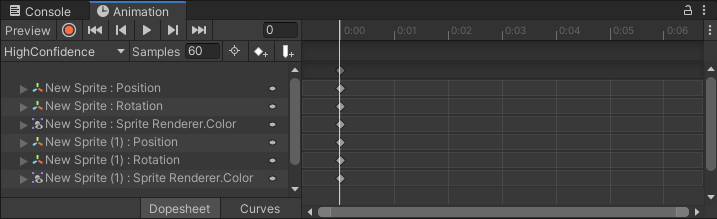

<blockquote class="note-block">The AnimationClips could be 1-keyframe clips as we did here and for the Triangle feedback. But it could also be a "real" animation with multiple keyframes. You could for example want a character interpolating from a walk animation at the confidence 0 to a run animation at the confidence 1.</blockquote>

#### Run

That's it. Now press play, then click and hold on the cube. You should see the 2 white sprites animating into a green X. 

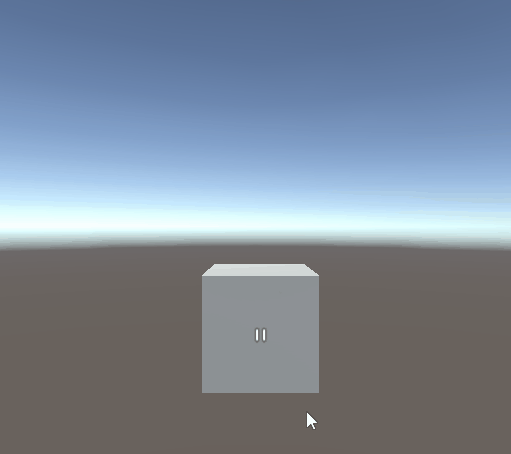


Tip: If you need a feedback loop evolving on a confidence range different from the default 0-1, it is also doable with this system. Let’s say you want a halo to keep its minimum size when the confidence is between 0 and 0.25, then grow up to 1. To achieve this, you would add a motion field to the blend tree, reference the StateOff animation on the 2 first clips, and StateOn in the third one. Then tweak the threshold values as you need (0, 0.25 and 1 in our example). 

 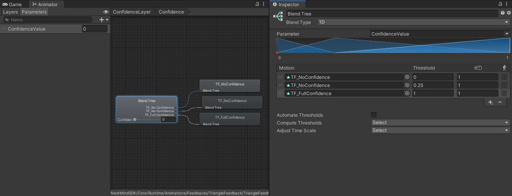
