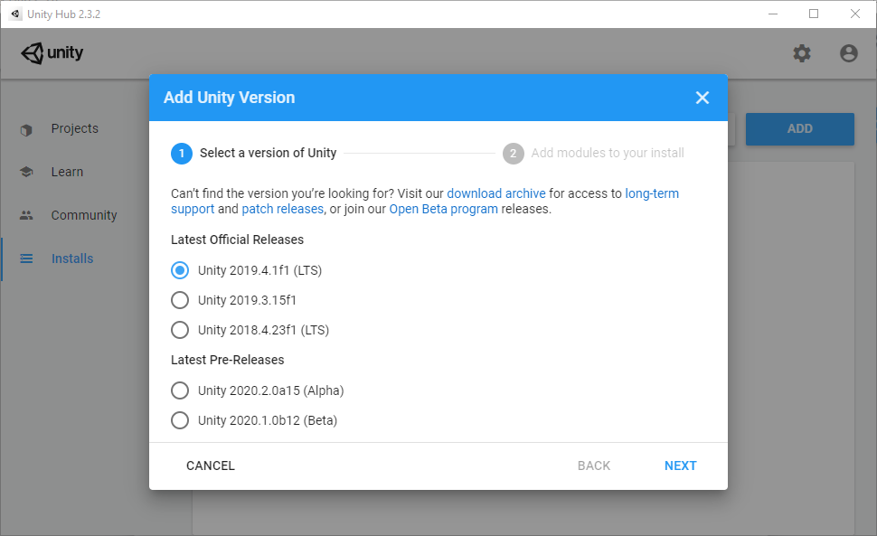

# Setting up the Environment

The following steps will help you to set up the right environment, allowing you to build your first app to exploit NextMind technology.

## Prerequisites

- *NextMindSDK* Unity package

## Install Unity Editor

The easiest way to download Unity and manage your projects is to use the **Unity Hub** that you can get from [Unity's official downloads](https://unity3d.com/get-unity/download) page, under "Download Unity Hub".

We recommend using **Unity 2019 LTS**.

To install Unity with Unity Hub:

- Go to **Installs** tab 
- Click on **Add** 
- Choose Unity 2019 LTS
- Select the components you need regarding the platforms your application will target. For tutorials to function, the default values are fine. 

If for any reason you cannot use Unity Hub, you can download Unity directly from [this page](https://unity3d.com/fr/get-unity/download/archive).

Once Unity installation is done, you are all set to create your first Unity project!

## Open a project

Open the Unity Hub, and open an existing project of yours using the **Projects** tab.

To create a new project, go to the **Projects** tab, then click on **New**. Keep the default settings (3D), give a name and location to your projects, and click on **Create**.

## XR Setup (optional)

The SDK is compatible with XR technologies. If you would like to set up an XR environment, we recommend following the steps described in the [Unity XR Plugin Framework](https://docs.unity3d.com/Manual/configuring-project-for-xr.html) documentation. 

<blockquote class="note-block">XR Plugin Framework is a fast evolving part of Unity, so make sure you stay up to date using the Package Manager update feature.</blockquote>

This setup is pretty straightforward and there aren't any NextMind-specific steps to be completed. However, here are a few points you still have to take into account:

- The shaders used within the SDK are not yet ready for [single-pass stereo rendering](https://docs.unity3d.com/Manual/SinglePassStereoRendering.html). This feature will be soon added to the SDK as we are currently working on it.
- Using 2 cameras in the scene to target each eye has not been fully tested until now. We recommend only using one camera with `Target eye` set to `Both`.

## Import the SDK

There are two ways to import the NextMind SDK's *unitypackage* in your project:

- Drag & drop `NextMindSDK.unitypackage` in the *project view* of Unity. 
- Or go to `Assets / Import Package / Custom package...`, then find `NextMindSDK.unitypackage` using the file picker.

A window called *Import Unity Package* should now pop up. Click on **import** and wait to the end of the process.

Once the import is done, you should see a new folder called `NextMindSDK` in the project window which contains a `Core` subfolder. This folder contains all the essential files to build an application using NextMind technology.

Your environment is now ready, and you can begin building your first application! Check out the next tutorial : [First Steps](building-first-application.md).  

