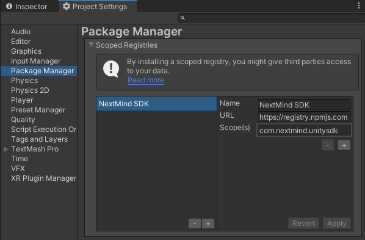
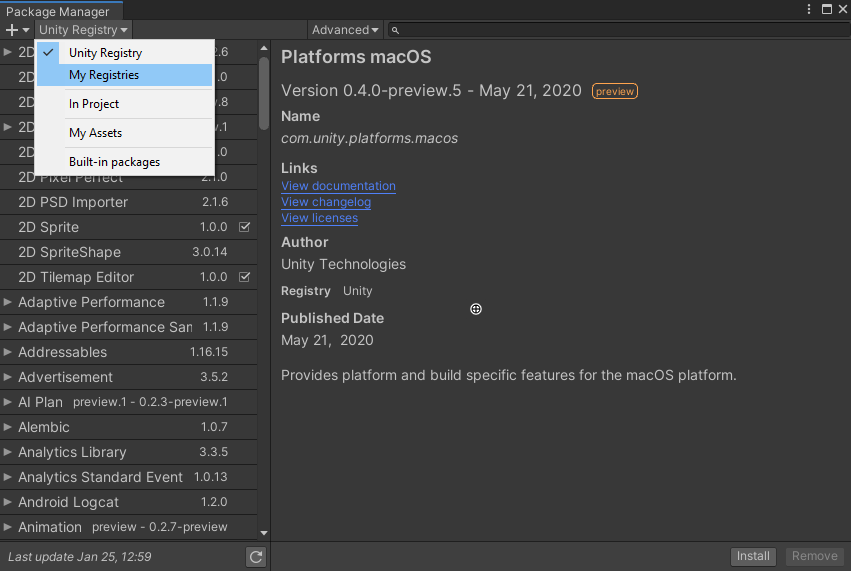
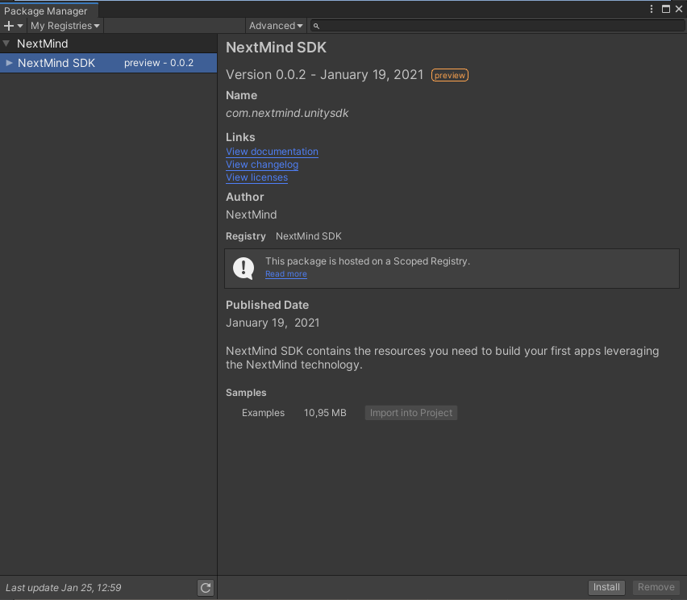
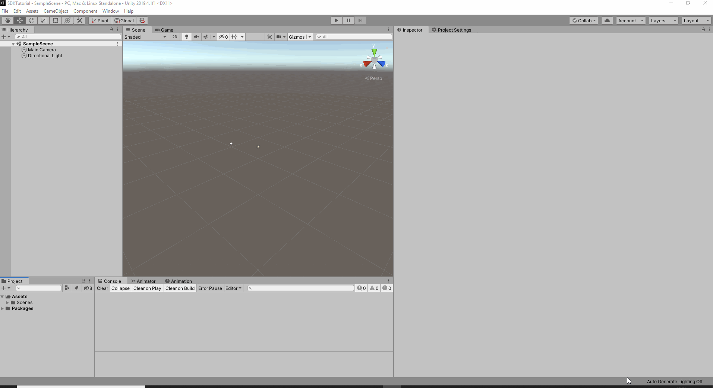

# Download

## NextMind Unity SDK set-up

There are two methods to download and install the **_NextMind Unity SDK_**:

- Unity Package Manager (UPM)
- Asset package

<blockquote class="note-block"><strong>Note</strong>: To properly run the <strong><em>NextMind Unity SDK</em></strong> make sure that the <strong><em>NextMind Manager</em></strong> is installed and launched on the machine that you are using. You can download it from the <a href="../downloads/README.md">Downloads page</a>.</blockquote>

## Install SDK using UPM

This is the recommended method to import the NextMind Unity SDK. It needs a quick preliminary setup, however managing the SDK versions within your project should be much reliable and faster once done. 

<blockquote class="note-block"><strong>Note</strong>: The following setup has to be done for each project.</blockquote>

### Video overview
https://user-images.githubusercontent.com/118914986/204540163-b1b1881a-9068-4a77-9e60-d8f8801ec526.mp4

### Scoped registry configuration

The first thing to do is to open the *Package Manager* section of the *Project Settings* and add a new entry to the *Scoped Registries* section with the following values : 

- *Name:* NextMind
- *URL:* https://registry.npmjs.com
- *Scope(s):* com.nextmind.unitysdk



Once this is done, simply click on *Apply*.

### NextMind SDK importation

Open the Unity Package Manager window and select *My Registries* in the dedicated dropdown list.



You should now see The NextMind SDK package. Click on install to import it in your project. 



Once installed, you will be able to import the example scenes as well. Unlike when using asset package (.unitypackage) files, this method does not automatically import the example scenes and assets. 

### Troubleshooting

A bug with early versions of Unity 2020.2 (fixed sinced 2020.2.4f1) is preventing you to use properly UPM Scoped registries as mentionned in this thread : https://forum.unity.com/threads/package-manager-not-showing-my-registries-option-in-2020-2-0b14.1020805/

Since this is just a UI bug, you can still do the previous steps manualy by editing the manifest.json file of your project : 

1. Open <projectRoot>/Packages/manifest.json in a text editor.
2. At the top of the manifest file, add the following lines : 

```
{
	"scopedRegistries": [
    {
      "name": "NextMind SDK",
      "url": "https://registry.npmjs.com",
      "scopes": [
        "com.nextmind.unitysdk"
      ]
    }
  ],
```

3. Add the com.nextmind.unitysdk to the *dependencies* section, with the wanted version number.

```
"dependencies": {
	"com.nextmind.unitysdk": "1.0.0"
```

4. You should now be able to see NextMind package in the "My Registries" section.

## Install SDK using the asset package

The second method to import the NextMind SDK in your project is to simply use the NextMindSDK asset package (.*unitypackage* file). This process is a little faster than using UPM, but will be less convenient to manage the SDK versions. 
There are two ways to import an asset package in your project:

- Download the asset package [here](../downloads/NextMindSDK-1.5.1.unitypackage).
- Drag & drop `NextMindSDK.unitypackage` in the *project view* of Unity. 
- Or go to `Assets / Import Package / Custom package...`, then find `NextMindSDK.unitypackage` using the file picker.

A window called *Import Unity Package* should now pop up. Click on **import** and wait to the end of the process.


