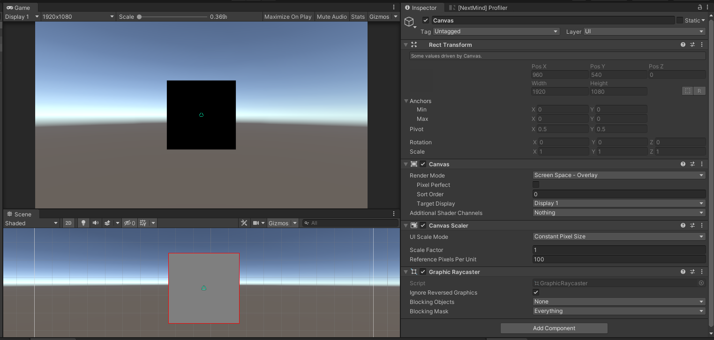
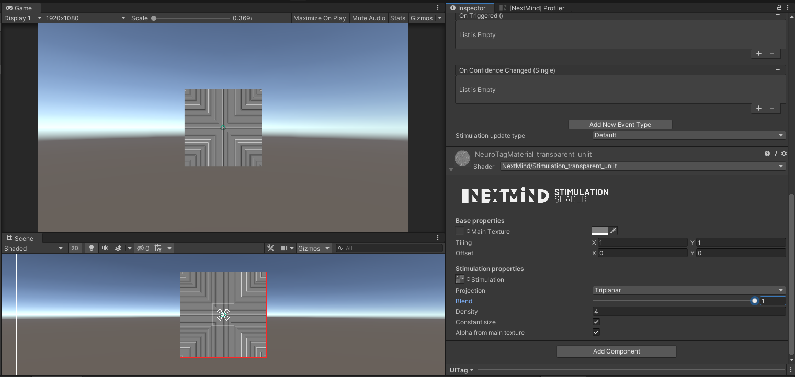
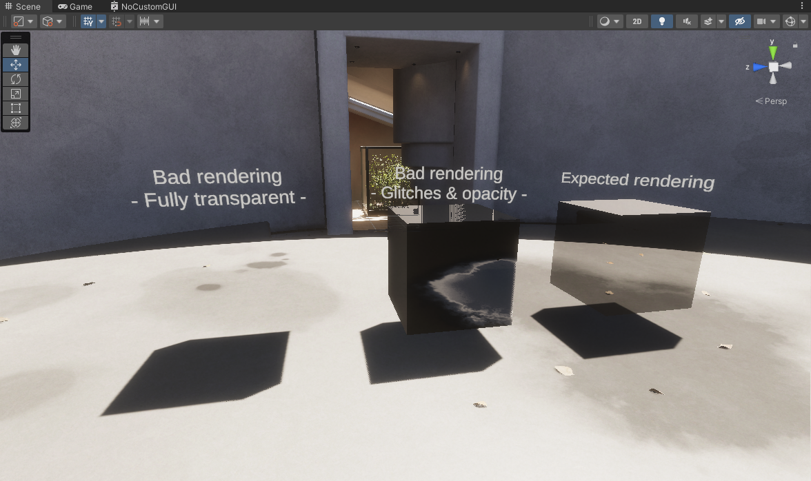
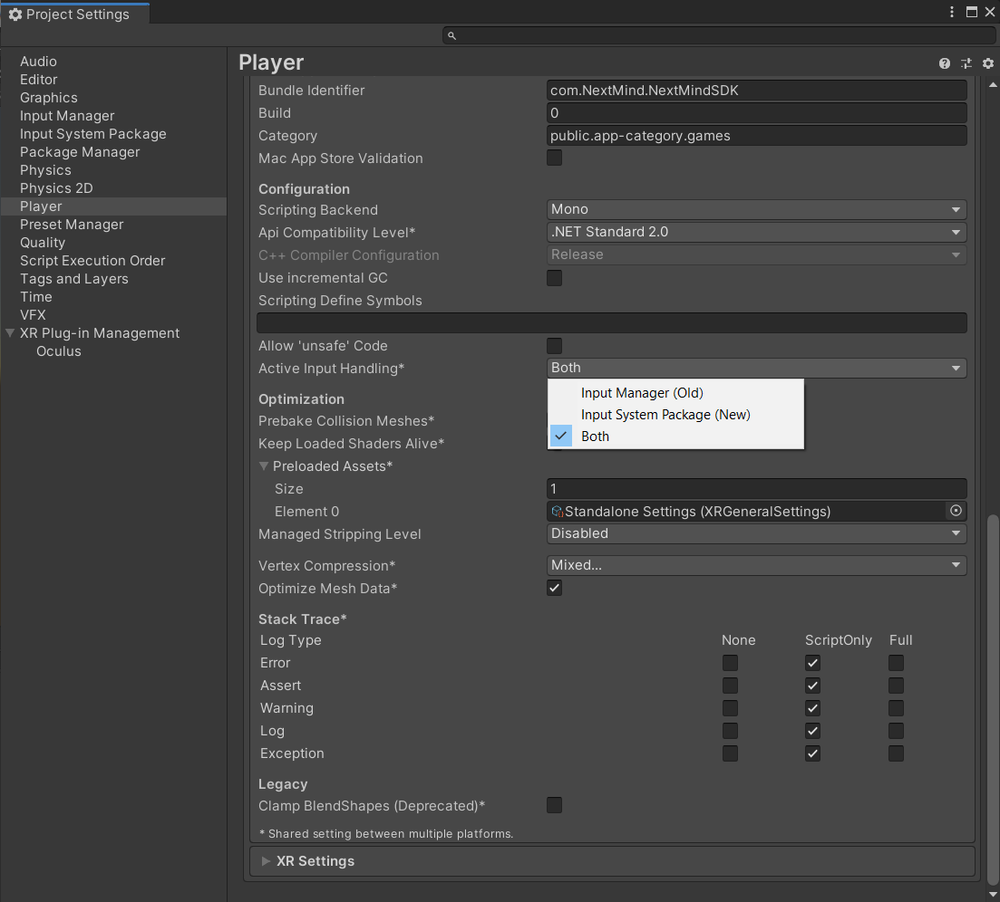
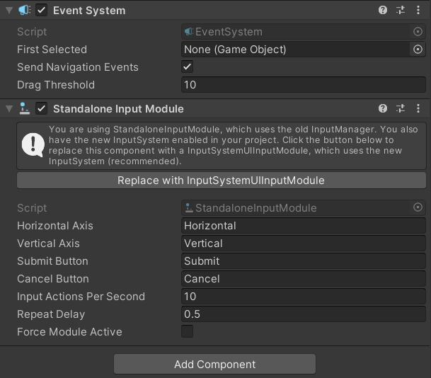
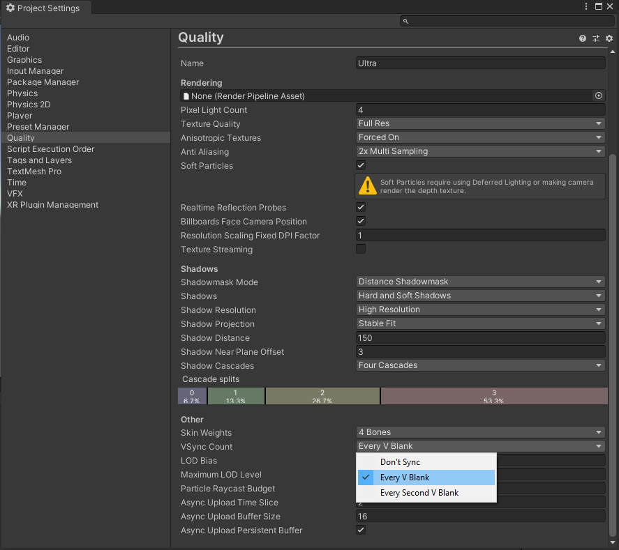
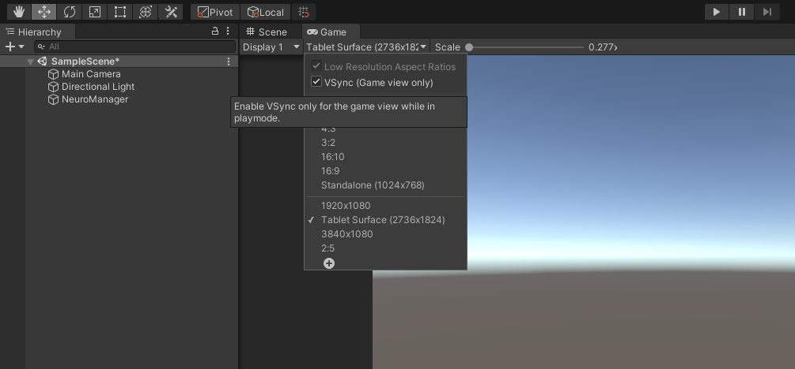
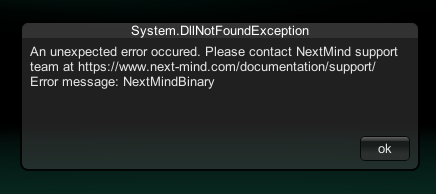
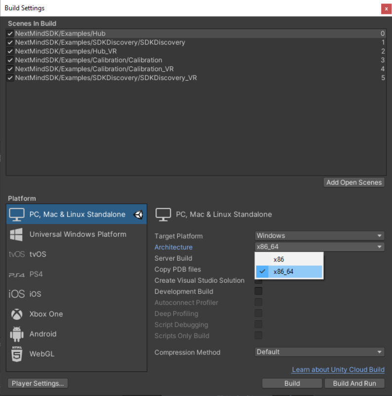

# Known issues & workarounds

In this section, we have listed issues you may encounter while developing your application and ways you can work around them.

## Canvas objects rendered black

#### Issue description:

While building your scene using Canvas, you may encounter the following issue: your objects render correctly in the Scene view, whereas in the Game view they are totally black. This is a known bug of the Unity Editor when using custom shaders on `Screen Space - Overlay` Canvas objects. 

Here are some threads on it:

- https://answers.unity.com/questions/1618238/ui-image-with-material-works-in-scene-mode-but-bla.html?childToView=1642248#comment-1642248 
- https://answers.unity.com/questions/1220236/ui-image-dsiplayed-as-black-when-using-screen-spac.html



#### Workaround:

Set the Canvas' `Render Mode` to `Screen Space - Camera` and reference the right Camera in the field `Render Camera`, or set the `Render Mode` to `World Space`.

## NeuroTags badly rendered

#### Issue description: 

While building your scene using Canvas, you may encounter the following issue: your canvas objects using NextMind shaders are rendering the stimulation texture abnormally.

#### Workaround:

This is due to the shaders that aren't properly handling the stimulation texture's triplanar projection on default canvas. There are two ways to work around this issue: 

- Set the `Projection` property of the object's material to `Standard` or `Screen Coordinates`.
- Add `Normal` to the Canvas `Additional Shader Channels` property.  

## Material rendering issues in HDRP

#### Issue description:

After assigning a transparent NextMind shader on a new material, the material becomes fully transparent and/or displays some glitches on the object:



This is caused by a bug in some versions of Unity's ShaderGraph package. This bug is currently being investigated by Unity: https://issuetracker.unity3d.com/issues/hdrp-transparent-shadergraph-isnt-rendering-correctly-when-using-custom-editor-gui 

#### Workaround: 

This can be fixed following these few steps:

- Select the Material, then in the Inspector,  click on the 3 dots in the top-right corner, then click on *Reset*. The Material should no longer appear fully transparent.
- Open the ShaderGraph assigned to the Material: click on the 3 dots again and *Edit Shader...* 
- In the *Graph Inspector*, copy the value of *Custom Editor GUI* property (you will have to re-enter it in a later step)
- Empty the string from this same property then click on *Save Asset* in the top-left corner of the ShaderGraph window.
- Go back to the Scene window. Notice that the shader has the correct aspect now. 
- Open the shader again, enter the original value in the *Custom Editor GUI* property, and click on *Save Asset*.

## Unity's new Input System issues

### Simulate focus property

#### Issue description: 

While using Unity's new input system, you may notice that `Focus Simulation` is not working: even if the checkbox is checked on the NeuroManager, clicking on a NeuroTag will not allow you to interact with it.

#### Workaround:

The focus simulation is currently using Unity's old input system by getting mouse clicks from `Input.GetMouseButton`. If you need this feature, your only option is to set the `Active Input Handling` to `Both` in the player settings:



### Example scenes navigation

#### Issue description:

While using Unity's new input system, you are not able to navigate through the steps.

#### Workaround:

Regarding the issue happening within SDK's example scenes, you have 2 options: 

- Apply the `Both` value on `Active Input Handling` in the player settings
- Follow [this guide](https://docs.unity3d.com/Packages/com.unity.inputsystem@1.0/manual/Migration.html) to modify the scripts of the SDK (it will be done in further releases) and apply the update proposed by Unity on the EventsSystem's `Standalone Input Module` of the Hub scene:



## Computer overheating at runtime

#### Issue description:

When entering play mode inside a scene containing a NeuroManager, you may hear the fan turning at full speed until you press Stop. This is often due to the number of FPS reaching too high levels. 

#### Workaround:

You can fix this in two different ways:

- Application.targetFrameRate ([https://docs.unity3d.com/ScriptReference/Application-targetFrameRate.html](https://docs.unity3d.com/ScriptReference/Application-targetFrameRate.html))

  Use this property in the `Start` function of one your scene's MonoBehaviours. You should set the lowest value that is acceptable for you. For example, if you choose a frame rate of 90fps, write it like this :

  ```c#
  private void Start()
  {
      Application.targetFrameRate = 90;
  }
  ```

- Vertical Synchronisation (https://docs.unity3d.com/Manual/class-QualitySettings.html)

  The vertical synchronisation can be set from Edit>Project Settings>Quality. In the *Other* section, you have to change the `VSync Count` property to `Every V Blank` or `Every Second V Blank` 

  

  The VSync has to be enabled in the Game view as well:

  

## DllNotFoundException message

#### Issue description:

When running the app, the message below is displayed: 



#### Potential fixes:

- This message is mostly displayed when an unsupported architecture is selected in the *build settings*. Make sure the right platform is selected, check the [software compatibility page](unity-sdk-intro.md#software-compatibility).

  

- It may also be displayed if a SDK's library is not present in your project. In this case, please download & import the SDK again in your project (at least the Plugins folder).

## Built MacOS application crashes at start

#### Issue description:

On MacOS, all works well in the Unity editor, but when the application is built, a crash occurs right after it starts.

#### Potential fixes:

- Bluetooth usage description: Before building, add a description in *Project settings > Player settings > Other > Bluetooth usage description*. This will set the message displayed by macOS when asking for Bluetooth permission. 

## NeuroTags not activated

#### Issue description:

The NeuroTags in the scene remain inactive after pressing play. You notice at least one of these symptoms: 

- NeuroTag's gizmos remain red in the Scene view and not declared as Active in NextMind Profiler
- The stimulation is not happening (i.e. the stimulation texture is not switched on/off rapidly)

#### Potential fixes:

- NeuroManager: 
  - make sure a `NeuroManager` is present in your scene
  - make sure a Camera is set on the NeuroManager's `Tracking Camera` property (The Camera tagged as Main Camera is used if this property is null).
  - make sure the NeuroManager is declared as `Ready` in the profiler, or by code using `NeuroManager.IsReady()` function.
- Visibility from the Tracking Camera:
  - make sure the NeuroTags are inside the Tracking Camera's FOV.
  - make sure the object is on a layer visible to the camera (check Camera's `Culling Mask` property)
- NeuroTag:
  - make sure NeuroTag' `Stimulation renderers` property is properly set with renderers which should show the stimulation
  - make sure these renderers have a material using a NextMind shader (may not be needed if you are using a custom stimulation)
  - make sure the `Stimulation update type` is set to `Default` if you do not intend on using a custom stimulation
  - make sure the limitation of 10 active NeuroTags is not already reached. In this case, only the first 10 NeuroTags will be active

## Simulate Focus property malfunctioning

#### Issue description: 

When clicking on NeuroTags in Play Mode, nothing happens.

#### Potential fixes:

- Usage: 
  - make sure to hold the mouse button while simulating the focus. NeuroTag's confidence value is not set to 1 directly. It will be smoothly interpolated from the current confidence value to 1.
- NeuroManager:
  - make sure the `Simulate Focus` is checked
- NeuroTag:
  - make sure the NeuroTag is active (if not, consult dedicated troubleshooting section)
  - make sure the Stimulation renderer targeted by the NeuroTag has:
    - if it is a Canvas object, `Raycast Target` property checked, and the Canvas has a `Graphic Raycaster` component
    - else a `Collider` or `Collider2D`
- Project Settings:
  - make sure to use the right `Active Input Handling` value (see [Unity's new Input System issues section](#unitys-new-input-system-issues) on this page)
