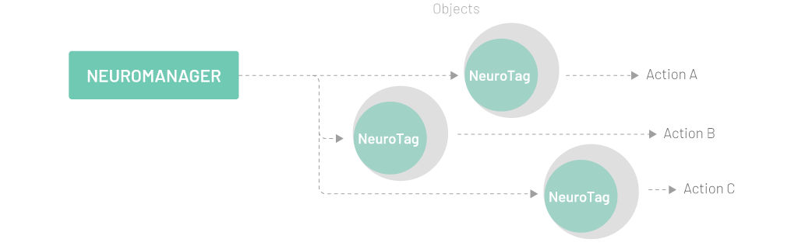

# Unity SDK Overview

Welcome to the NextMind Unity SDK documentation. This section describes the SDK components and will help you design your own NextMind-enabled apps.

## Presentation

The Unity SDK has been designed to facilitate the development of games and applications, exploiting the NextMind technology. It uses a high-level API that allows you to build your project without struggling on low-level aspects. The NextMind SDK is designed to reduce complexity to the point where the only question you’ll need to worry about is: "Which objects do I want to interact with using just my mind?".

The NextMind SDK is built around two main components:

- a **NeuroTag** that makes any object in your application "mind-interactible".
- the **NeuroManager** that manages the communication between the NeuroTags on the scene and the core of the NextMind Engine.

Apart from these two main components, the NextMind SDK offers a large range of functions that can be used to customize applications. A user can obtain information from the NextMind Sensor (such as: battery level, contact, etc.), manage the Bluetooth scanning behavior, simulate inputs, etc.

After defining the NeuroTags, it is up to you to implement the actions that they are supposed to trigger. The possibilities of release actions are endless as you can connect NeuroTags with any digital or external outputs.

<blockquote class="note-block">The current version of the SDK can handle up to 10 active NeuroTags at the same time. This number is likely to be improved in future releases.</blockquote>

## Content

The SDK contains two types of assets: 

- Core assets: All the essential files needed to build a NextMind-enabled app. You'll find inside the core libraries exposing the main classes, and some convenient assets (prefabs, shaders, components, tools, etc...).
- Examples assets: Several examples of how to use the SDK, showing best practices (for instance, how to build your custom calibration app, or how to tag an object).

To learn more about how to download, import and use these assets, further information can be found in the tutorials section.

## Sensor specifications
- Dimension – 135x66x55mm
- Weight - 60 grams
- Headband size – 54 cm to 62 cm
- Clip-on system - can be clipped directly on a headband, a cap or a VR/AR headset
- EEG - 9 high quality electrodes
- Battery - Lithium-Polymer battery (3.7 V 240 mAh) - 8H of continuous use - Rechargeable in 2H
- Connectivity - USB-C Connected to a computer or any USB charger (5V DC)

## Software minimal requirements
- Bluetooth LE support (4.0)
- Graphics - DX9 shader model 2.5, Intel HD 2500 equivalent
- CPU - Intel i5-4590, AMD FX 8350 equivalent
- RAM - 8GB

## Software compatibility
- Unity - 2020LTS, 2019LTS
- Platforms - Windows 10 64bits, Apple macOS 64bits (Mojave, Catalina, Big Sur)
- Form factor and software tested and approved - Oculus Rift, Oculus Quest 1 & 2, HTC Vive and Pro, HoloLens 1
- Verified software compatibility - Valve Index, HoloLens 2
